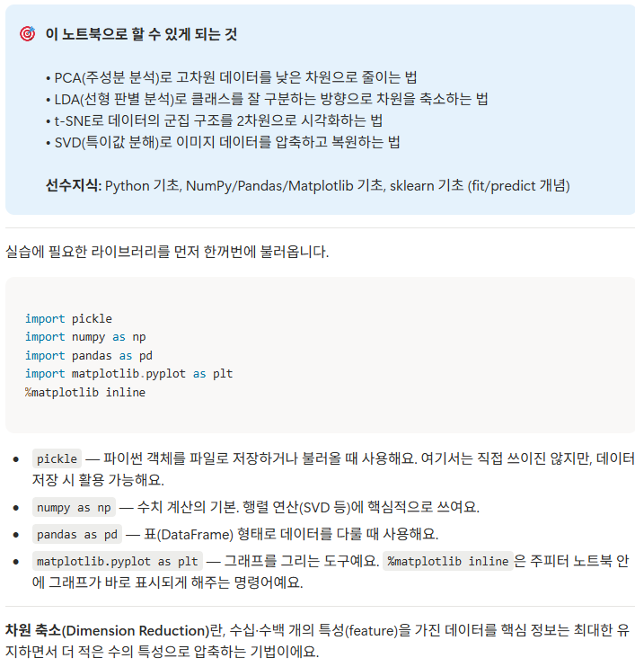

# code-guidebook-notion

Jupyter 노트북(.ipynb) 폴더를 **코드를 하나도 모르는 사람도 익힐 수 있는 가이드북**으로 만들어 Notion DB에 올리는 Claude Code 스킬입니다. 노트북 1개 = 노션 페이지 1개.

## 📸 결과물 예시 (실제 노션 페이지)


> 맨 위 🎯 목표 callout(할 수 있게 되는 것 + 선수지식) → import 라이브러리별 "무엇을·왜" → 코드 블록 + 한 줄씩 풀이. 아래로 실행결과(📤)·그림·✅ 체크리스트가 이어집니다.

## 결과물 모양 (가이드북 1개)
```
H1: 📘 [가이드북] <제목> (파란 배경)
🎯 callout: 이 노트북으로 할 수 있게 되는 것 + 선수지식
import 섹션: 라이브러리마다 "무엇을·왜"
── 의미 단위 섹션(h2/h3) 반복 ──
  code: 실제 코드 발췌
  p: 한 줄씩 무슨 뜻인지 풀이 + 함수 문법
  bul/표: 하이퍼파라미터 = 의미·권장기준 + ⚙️ 실무 팁
  output: 실제 실행 결과 + "이 결과는 ~예요"
  image: 코드가 만든 그림(matplotlib 등, Drive 임베드) + 해설
✅ 핵심 체크리스트
```

## 언제 자동 호출되나
"코드 가이드북 만들어줘", "노트북을 노션에 초보자용으로", "ipynb를 노션에 코드 결과·그림까지 붙여서" 등.

## 설치
저장소 루트 README의 설치 안내를 따라 이 폴더를 `~/.claude/skills/code-guidebook-notion/` 에 복사하세요.

## 사전 준비
- Python 3.10+ (노트북 추출은 표준 라이브러리만 사용)
- rclone + `gdrive` remote(사용자 인증), Notion MCP 연결
- 환경변수: `METACODE_ROOT`(노트북 루트), 대상 DB는 호출 시 지정

## 사용 절차 (`scripts/`)
모든 실행에 `PYTHONUTF8=1 PYTHONIOENCODING=utf-8` 를 붙입니다.

| 단계 | 스크립트 | 하는 일 |
|------|----------|---------|
| **0. 사전점검** | `preflight.py gb "<폴더>" --db "<DB>"` | 폴더·.ipynb·rclone·DB 확인. 외부 드라이브/캐글 링크 감지 |
| 1. 추출 | `extract_notebooks.py <주차폴더>` | 코드/마크다운 + 출력(outputs) + 그림 → `nb_<slug>.json`, base64 그림 PNG 저장 |
| 2. 그림 업로드 | `upload_guidebook_images.py <주차폴더>` | 그림 → Google Drive + 공개 URL(`gb_drive_urls.json`) |
| 3. spec 작성 | (수기/에이전트) `gb_<slug>.json` | 가이드북 본문. 스키마: [`references/GUIDEBOOK_SCHEMA.md`](./references/GUIDEBOOK_SCHEMA.md) |
| 4. 변환·청크 | `build_guidebook.py <gb_json> <out_dir> <prefix>` | 노션 블록 변환 + 25블록 청크 |
| 5. 업로드 | Notion MCP | 페이지 생성 후 청크 append |

> `output_images`의 **그림 key는 절대 지어내지 말 것** — nb json에 있는 값만 `image_ref` 로 사용.
> `build_guidebook.py` 는 같은 폴더의 `03_build_notion.py`(→ `config.py`)를 불러오므로 두 파일이 함께 있어야 합니다(포함돼 있음).

## 작성 양식 (고정)
- 대상: **코드 0 기초자**. 변수·함수·문법을 풀어 설명, 친근한 어투
- 맨 위 🎯 목표 callout → import 설명 → 코드 한 줄 풀이 → 하이퍼파라미터 → output/그림 → 맨 끝 ✅ 체크리스트
- 노트북에 없는 내용 날조 금지(개념 보충은 OK)

## ⚠️ 업로드 불변 규칙
- 읽은 청크를 **변형 없이 그대로** 업로드(code/image/equation 유지).
- 업로드 에이전트는 **`executor`(sonnet)**. 25블록 청크, 에이전트당 청크 ≤8(8개 초과면 c01~c08 → c09~ 순차 배치).

자세한 내용은 [`SKILL.md`](./SKILL.md) 참고.
